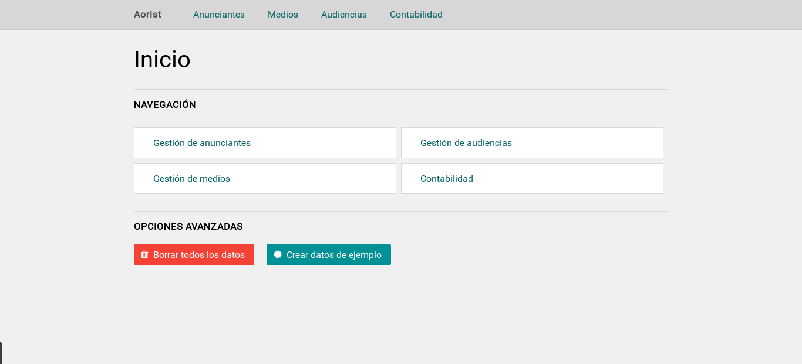
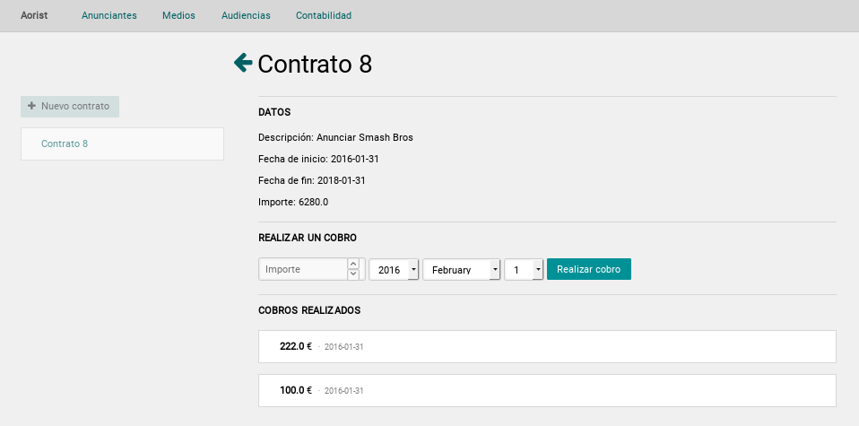
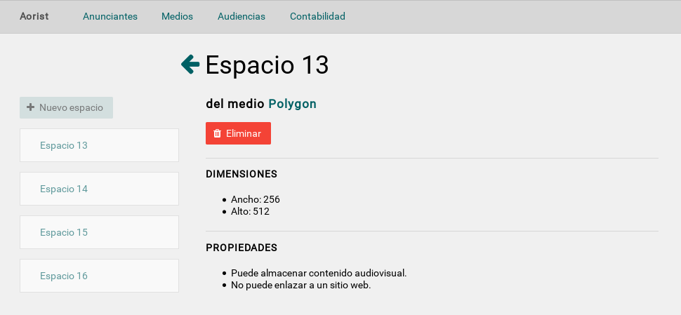
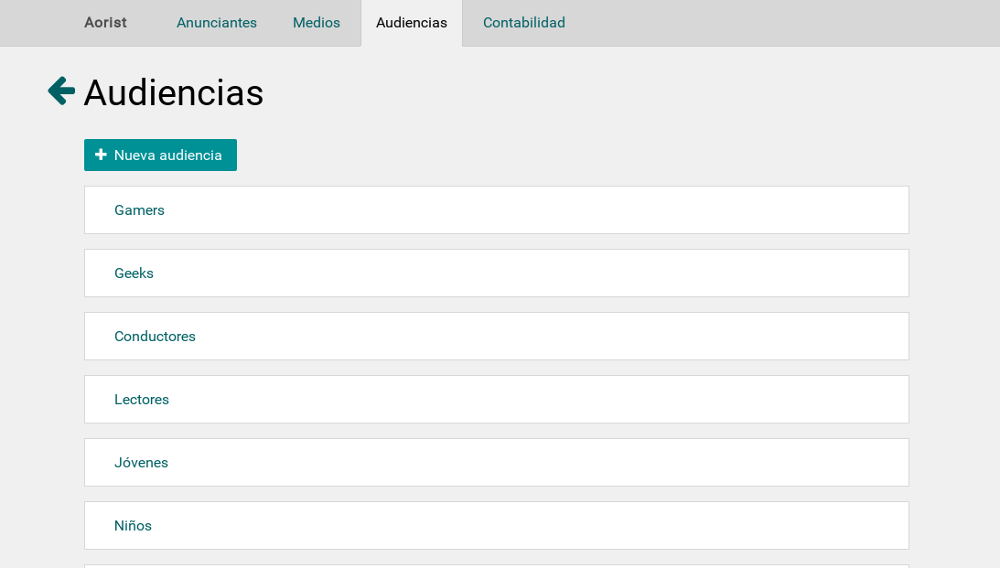
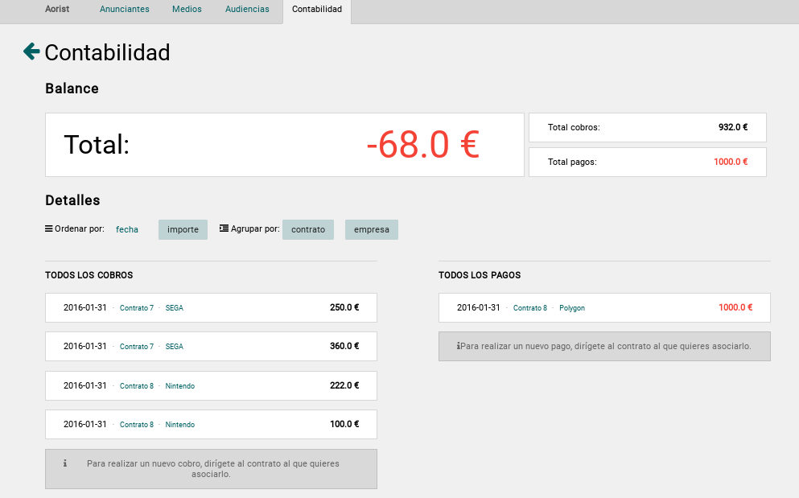

# Descripción
Aorist (Ad Oriented Information System) es un sistema de gestión dirigido a empresas de publicidad, principalmente orientado a la publicidad online. El sistema modela las empresas anunciantes y los medios de forma que se puedan relacionar mediante los anuncios de las primeras y los espacios publicitarios de los segundos. Además, se facilita la segmentación del mercado y la asociación entre anunciantes y medios con audiencias afines.

## Áreas funcionales

* Gestión de anunciantes:
Permite dar de alta empresas que quieran promocionar sus productos, relacionarlas con tipos de audiencia y la creación de contratos con dichas empresas.

* Gestión de medios:
Permite dar de alta y gestionar los medios donde se visualizarán los anuncios, por ejemplo: sitios web, aplicaciones móviles, revistas... Cada medio puede ir relacionado con ciertos tipos de audiencia y se pueden crear contratos asociados.

* Anuncios y espacios:
Incluye la creación de distintos tipos de espacios que después se podrán ocupar mediante anuncios asociados a los anunciantes.

* Transacciones económicas:
Permite tramitar los cobros a las empresas anunciantes, y los pagos a los medios.

* Audiencia:
Administra los distintos perfiles de visitantes que se ofertan a los anunciantes y en función de los cuáles se distribuyen los anuncios a los medios.

\pagebreak

# Requisitos

## Requisitos funcionales

### Funcionalidad "Gestión de anunciantes"

Desarrollados en el documento asociado: *Requisitos de Gestión de Anunciantes*.

\rf{Dar de alta una empresa anunciante}
\rf{Dar de baja una empresa anunciante}
\rf{Realizar contrato}
\rf{Mostrar los datos de una empresa anunciante}

### Funcionalidad "Gestión de medios"

Desarrollados en el documento asociado: *Requisitos de Gestión de Medios*.

\rf{Dar de alta un nuevo medio}
\rf{Dar de baja un medio}
\rf{Mostrar los datos de un medio}
\rf{Realizar contrato con un medio}

### Funcionalidad "Anuncios y espacios"

Desarrollados en el documento asociado: *Requisitos de Anuncios*.

\rf{Dar de alta nuevo espacio publicitario}
\rf{Eliminar espacio publicitario}
\rf{Dar de alta nuevo anuncio}
\rf{Obtener anuncio}
\rf{Modificar anuncio}
\rf{Asignar anuncio a espacio publicitario}
\rf{Mostrar anuncios puestos en marcha}
\rf{Eliminar anuncio}

### Funcionalidad "Transacciones económicas"

Desarrollados en el documento asociado: *Requisitos de Transacciones Económicas*.

\rf{Hacer un pago a medio}
\rf{Hacer un cobro a anunciante}
\rf{Obtener balance}
\rf{Obtener transacciones ordenadas por importe}
\rf{Gasto por anunciante y medio}
\rf{Gasto por contrato}

### Funcionalidad "Audiencia"

Desarrollados en el documento asociado: *Requisitos de Audiencia*.

\rf{Insertar un nuevo tipo de audiencia}
\rf{Asociar un medio frecuentado por una audiencia}
\rf{Asociar una audiencia preferida por un anunciante}
\rf{Desasociar un medio frecuentado por una audiencia}
\rf{Desasociar una audiencia preferida por un anunciante}
\rf{Mostrar información sobre las audiencias disponibles}

## Requisitos de datos

Desarrollados en *Requisitos de Gestión de Anunciantes*:

\rd{Datos almacenados de empresa anunciante}
\label{rdanun1}
\rd{Datos requeridos para registrar una empresa anunciante}
\label{rdanun2}
\rd{Datos almacenados de un contrato con un anunciante}
\label{rdanun3}

Desarrollados en *Requisitos de Gestión de Medios*:

\rd{Datos almacenados de Medio}
\label{rdmedio1}
\rd{Datos necesarios para almacenar un Medio}
\label{rdmedio2}
\rd{Datos almacenados de un contrato con un medio}
\label{rdmedio3}

Desarrollados en *Requisitos de Anuncios*:

\rd{Datos almacenados para Espacio publicitario}
\label{rdtipo}
\rd{Datos almacenados para Anuncio}
\label{rdanuncio}
\rd{Datos requeridos para crear Espacio publicitario}
\label{rdtipo2}
\rd{Datos requeridos para crear Anuncio}
\label{rdanuncio2}

Desarrollados en *Requisitos de Transacciones Económicas*:

\rd{Datos requeridos para pago a medio}
\label{rdtrans1}
\rd{Datos requeridos para cobro a anunciante}
\label{rdtrans2}
\rd{Datos almacenados de pago}
\label{rdtrans3}
\rd{Datos almacenados de cobro}
\label{rdtrans4}

Desarrollados en *Requisitos de Audiencia*:

\rd{Datos almacenados de Audiencia}
\label{rdaudi}

## Restricciones semánticas

Desarrolladas en *Requisitos de Gestión de Anunciantes*:

\rs{Contratos}
\rs{Fecha contratos}

Desarrolladas en *Requisitos de Gestión de Medios*:

\rs{Contratos medio}
\rs{Fecha contratos medio}

Desarrolladas en *Requisitos de Anuncios*:

\rs{Espacios y anuncios}
\rs{Anuncios y empresas}
\rs{Anuncios y espacios incompatibles}

Desarrolladas en *Requisitos de Transacciones Económicas*

\rs{Pagos}
\rs{Fecha}

Desarrolladas en *Requisitos de Audiencia*:

\rs{Medios y anunciantes}

# Diseño de la aplicación

## Diagramas de flujos de datos y esquemas externos

### Armazón

#### Diagrama de caja negra

\begin{center}\includegraphics[width=0.8\textwidth,keepaspectratio]{img/diagramas/cajanegra.png}\end{center}

#### Diagrama armazón F

\begin{center}\includegraphics[width=\textwidth,height=\dimexpr\textheight-4\baselineskip\relax,keepaspectratio]{img/diagramas/armazonF.png}\end{center}

#### Esquemas externos para el diagrama armazón F

\begin{center}\includegraphics[width=\textwidth,height=\dimexpr\textheight-4\baselineskip\relax,keepaspectratio]{img/diagramas/externos_armazonF.png}\end{center}

#### Diagrama armazón D

\begin{center}\includegraphics[width=0.3\textwidth,keepaspectratio]{img/diagramas/armazonD.png}\end{center}

### Primer refinamiento

#### Plano de refinamiento F de primer nivel

\begin{center}\includegraphics[width=\textwidth,height=\dimexpr\textheight-4\baselineskip\relax,keepaspectratio]{img/diagramas/plano_refinamiento1.png}\end{center}

#### Esquemas externos del plano de refinamiento F

\begin{center}\includegraphics[width=\textwidth,height=\dimexpr\textheight-4\baselineskip\relax,keepaspectratio]{img/diagramas/externos_refinamiento1.png}\end{center}

### Segundo refinamiento

#### Plano de refinamiento F de segundo nivel

\begin{center}\includegraphics[width=\textwidth,height=\dimexpr\textheight-4\baselineskip\relax,keepaspectratio]{img/diagramas/plano_refinamiento2.png}\end{center}

#### Esquemas externos del plano de refinamiento F

\begin{center}\includegraphics[width=\textwidth,height=\dimexpr\textheight-4\baselineskip\relax,keepaspectratio]{img/diagramas/externos_refinamiento2.png}\end{center}

## Diagrama conceptual

### Unión de los esquemas externos

\begin{center}\includegraphics[width=\textwidth,height=\dimexpr\textheight-4\baselineskip\relax,keepaspectratio]{img/diagramas/ER.png}\end{center}

### Diagrama resultante

\begin{center}\includegraphics[width=\textwidth,height=\dimexpr\textheight-4\baselineskip\relax,keepaspectratio]{img/diagramas/ER_atributos.png}\end{center}

## Operaciones de datos

### Descripción de las operaciones

#### O1: Alta de un medio

Insertar un nuevo medio a partir de su identificador, nombre, sitio web y datos fiscales.

#### O2: Baja de un anunciante

Eliminar un anunciante dado su identificador.

#### O3: Obtención de pagos

Buscar los pagos asociados a contratos de medio a partir del identificador del medio.

#### O4: Modificación de anuncio

Actualizar el contenido y URL de un anuncio, dado su identificador.

### Esquemas de operación

\begin{center}\includegraphics[width=\textwidth,height=\dimexpr\textheight-4\baselineskip\relax,keepaspectratio]{img/diagramas/operacion.png}\end{center}

### Esquemas de navegación

\begin{center}\includegraphics[width=\textwidth,height=\dimexpr\textheight-4\baselineskip\relax,keepaspectratio]{img/diagramas/navegacion.png}\end{center}

## Diseño lógico

Anunciante(\underline{ID anunciante}, Nombre, Sitio web, Datos fiscales)

Medio(\underline{ID medio}, Nombre, Sitio web, Datos fiscales)

Anuncio(\underline{ID anuncio, ID anunciante}, Contenido, URL)  
*FK*: ID anunciante $\rightarrow$ Anunciante.ID anunciante

Espacio(\underline{ID espacio, ID medio}, Multimedia, Tamaño, Enlace)  
*FK*: ID medio $\rightarrow$ Anunciante.ID medio

Audiencia(\underline{ID audiencia}, Nombre, Descripción)

Contrato_anunciante(\underline{ID contrato anunciante, ID anunciante}, Fecha, Importe, Descripción, Duración)  
*FK*: ID anunciante $\rightarrow$ Anunciante.ID anunciante

Cobro(\underline{ID cobro}, ID contrato anunciante, ID anunciante, Importe, Fecha) (Fusión de tablas)  
*FK*: ID contrato anunciante $\rightarrow$ Contrato_anunciante.ID contrato anunciante
*FK*: ID anunciante $\rightarrow$ Anunciante.ID anunciante

Contrato_medio(\underline{ID contrato medio, ID medio}, Fecha, Duración, Importe, Descripción)  
*FK*: ID medio $\rightarrow$ Anunciante.ID medio

Pago(\underline{ID pago}, ID contrato medio, ID medio, Importe, Fecha) (Fusión de tablas)  
*FK*: ID contrato medio $\rightarrow$ Contrato_medio.ID contrato medio  
*FK*: ID medio $\rightarrow$ Anunciante.ID medio

Se_asigna(\underline{ID espacio, ID medio}, ID anuncio, ID anunciante)  
*FK*: ID espacio $\rightarrow$ Espacio.ID espacio  
*FK*: ID medio $\rightarrow$ Anunciante.ID medio  
*FK*: ID anuncio $\rightarrow$ Anuncio.ID anuncio  
*FK*: ID anunciante $\rightarrow$ Anunciante.ID anunciante

Interesa(\underline{ID anunciante, ID audiencia})  
*FK*: ID anunciante $\rightarrow$ Anunciante.ID anunciante  
*FK*: ID audiencia $\rightarrow$ Audiencia.ID audiencia

Visita(\underline{ID medio, ID audiencia})  
*FK*: ID medio $\rightarrow$ Medio.ID medio  
*FK*: ID audiencia $\rightarrow$ Audiencia.ID audiencia

# Implementación

## Guía de instalación

Esta es una guía para instalar Aorist en un sistema operativo con kernel Linux, creada y seguida desde Ubuntu 14.04.

### Dependencias previas

Necesitaremos paquetes para la gestión de la base de datos y un intérprete de JavaScript. Para la base de datos, instalamos *sqlite3*, mientras que como intérprete de JavaScript usaremos *nodejs*. Podemos instalarlos con los comandos:

~~~sh
sudo apt-get install sqlite3
sudo apt-get install nodejs
~~~

### Instalación de Ruby

En caso de que no tengamos Ruby instalado en nuestro sistema, es necesario realizar esta instalación. Lo haremos instalando previamente RVM (*Ruby Version Manager*), que nos permitirá usar Ruby con mayor comodidad. Para instalar RVM y Ruby ejecutaremos los siguientes comandos:

~~~sh
gpg --keyserver hkp://keys.gnupg.net --recv-keys\
  409B6B1796C275462A1703113804BB82D39DC0E3
\curl -sSL https://get.rvm.io | bash -s stable --ruby
~~~

En este punto ya tendremos instalado RVM con Ruby. Seguidamente,  ejecutamos el comando `source /home/usuario/.rvm/scripts/rvm` para poder usar rvm. Cambiaremos de versión de Ruby a la 2.2.1 con el comando `rvm use 2.2.1`.

### Instalación de las gemas y migración de la base de datos

Ya tenemos instalado Ruby. Ahora tenemos que instalar las gemas necesarias. Para empezar, instalamos bundler con `gem install bundler`, lo que nos permitirá intalar el resto de gemas.

Una vez instalado, en la carpeta de la aplicación ejecutamos `bundle --without=test` para instalar todas las gemas necesarias para Aorist.

Instaladas las gemas, hemos de migrar la base de datos. Para ello, ejecutamos `rake db:migrate`. Una vez hecho esto, la aplicación está lista para usarse. Solo queda lanzar el servidor con el comando `rails server`.

## Descripción de la implementación

Aorist es una aplicación web implementada con Ruby on Rails siguiendo un patrón Modelo-Vista-Controlador. En esta sección detallaremos como gestiona Rails cada parte, y qué hemos implementado nosotros en cada una de ellas.

### Modelo

El modelo es la realización del diseño conceptual en forma clases que se comunican con la base de datos. Cada modelo corresponde al menos a dos archivos: un archivo de código Ruby en *models/nombre.rb* y un archivo de migración que Rails utiliza para ejecutar el código SQL necesario al llevar el modelo a la base de datos. Dicho archivo puede ser modificado para incluir más datos a nuestro modelo, así que no debemos preocuparnos si olvidamos algún atributo en el comando, y en ningún caso es necesario escribir sentencias de definición de datos en SQL.

En el archivo *models/nombre.rb* podremos especificar las relaciones de nuestro modelo con otros, mediante distintas asociaciones como *has_many* (uno a muchos, con el uno en el modelo actual), *belongs_to* (uno a muchos, con el uno en el otro modelo), *has_one* (uno a uno), etc... Esto creará automáticamente métodos para operar con los atributos relacionados de otro modelo que podremos usar en el controlador (por ejemplo, obtener todos los elementos de una entidad débil desde un elemento de la entidad fuerte). Dentro de este archivo podemos definir también validaciones, que son pequeñas comprobaciones que se hacen a la hora de insertar datos, como puede ser la presencia obligatoria de un dato, exigir que un valor numérico esté en un rango determinado, etc...

Generaremos un modelo para cada entidad en nuestro diagrama conceptual, y en ocasiones, en las relaciones muchos a muchos será necesario crear un modelo para la relación (esto depende de la asociación elegida, queda como decisión del programador). Dicha relación contendrá las claves externas de los elementos relacionados y cualquier atributo de la relación que pueda existir.

Una vez creados los modelos, hemos de migrar los archivos para que se modifique el esquema de la base de datos, con la creación de nuevas tablas y asociaciones. Dicha migración se hará con el comando de consola `rake db:migrate`, y hará que Rails interprete el código originado al crear el modelo y lo lleve a SQL. Una vez realizada la migración no podremos modificar los archivos que se han usado para esta, pero si queremos hacer cambios en la base de datos podemos crear una nueva migración y hacer los cambios dentro del archivo generado, en código Ruby. Para crear una migración, usaremos el comando `rails generate migration Nombre`.

### Vistas

Las vistas de la aplicación son código en formato Haml (HTML Abstraction Markup Language).

### Controladores

## Uso de Aorist

Aorist cuenta de cuatro partes: Gestión de anunciantes, Gestión de medios, Gestión de audiencias y Contabilidad. En la pantalla de inicio de la aplicación podremos acceder a cada una de ellas, además de hacer una gestión básica de los datos almacenados en la base de datos; podemos eliminar todo lo que hay almacenado, dejando la base de datos limpia, y podemos crear unos datos de ejemplo. Esta opción ha sido creada en vistas a una exposición de la aplicación, para no tener que introducir manualmente datos necesarios para visualizar el funcionamiento de la aplicación. En la Figura 1 podemos ver cómo es la pantalla de inicio de Aorist.

### Gestión de anunciantes

<!--
Algunas imágenes pendientes de incluir. Se modelará para que las menos relevantes estén unidas y no ocupen demasiado espacio.
-->

Al acceder al menú de Gestión de anunciantes, nos encontramos una pantalla con el listado de los anunciantes almacenados en el sistema, junto a la opción de crear un nuevo anunciante. Podemos verlo en la Figura 2.

Si accedemos al menú de creación de un nuevo anunciante, nos encontramos un formulario para rellenar los datos del nuevo anunciante: el nombre, la web y los datos fiscales. Además, a la izquierda podemos ver los anunciantes ya creados en el sistema, y podemos acceder a ellos pinchando en su recuadro. Esto puede ser visto en la Figura 3.

Si hacemos click en cualquier anunciante, accedemos a su ficha. En ella vemos todos sus datos y tenemos enlaces para ver sus anuncios, sus contratos y eliminar el anunciante, además de la lista de audiencias que tiene asociadas y las que no. Es posible asociarle una nueva audiencia con la opción que aparece al lado de cada una de las que no tiene asociadas.

Para acceder a los detalles de sus anuncios y contratos deberemos hacer click en la opción correspondiente. Podemos ver la ficha completa en la Figura 4.

Si accedemos a los anuncios de nuestro anunciante, se mostrarán dos listados: aquellos anuncios que están puestos en marcha (es decir, ya tengan un espacio asociado) y aquellos que no lo estén. Además, tendremos la opción de crear un nuevo anuncio asociado al anunciante, especificando su contenido y su URL, en caso de tenerla. De nuevo tendremos un listado de los anuncios ya existentes a la izquierda, como teníamos en los anunciantes.

En la ficha de cada anuncio tenemos sus datos y las opciones de editar dichos datos, lo que nos lleva a un formulario similar al de creación de un nuevo anuncio, y eliminarlo completamente del sistema. Además, podemos ver un listado de los espacios que tiene asociados (en caso de tener alguno) y de aquellos que no pero es posible establecer dicha asociación, con la posibilidad de realizarla. En estos espacios también se muestra el número de audiencias en común entre el anunciante y el medio, criterio a tener en cuenta a la hora de asociar el anuncio a algún espacio. Podemos verlo de forma detallada en la siguiente Figura.

Entrando ahora en los contratos de cada anunciante, nos encontramos de nuevo un listado con los contratos creados, con la posibilidad de acceder a un menú para crear uno nuevo proporcionando sus datos. Dentro de la ficha de cada contrato nos encontramos con todos sus datos, junto a sus cobros asociados y la posibilidad de registrar uno nuevo. Para ello simplemente especificaremos la fecha y el importe del cobro. Podemos ver estos menús en la Figura.

### Gestión de medios

El menú de Gestion de medios es similar al de Gestión de anunciantes. Inicialmente, nos encontramos un listado de todos los medios y la posibilidad de crear uno nuevo, accediendo a una pantalla donde especificar su nombre, web y datos fiscales. Dentro de la ficha de cada medio encontraremos sus datos, un enlace a sus contratos y a sus espacios, sus audiencias asociadas y las no asociadas (con la posibilidad de asociarle nuevas), y una opción de eliminar el medio del sistema. Podemos ver todo esto en las siguientes Figuras.

Si nos vamos a los espacios asociados a cada medio, encontramos un listado de los ya creados. Accediendo a cualquiera de ellos podemos ver sus datos y tenemos la posibilidad de eliminarlo del sistema. Al contrario que en los anuncios, los datos de los espacios no pueden ser editados, por tanto no nos encontraremos dicha opción.

Para los contratos asociados a un medio, nos econtraremos la misma funcionalidad que en los asociados a los anunciantes: tendremos un listado de los contratos, la posibilidad de crear uno nuevo, y en su ficha podremos visualizar sus datos y crear un nuevo pago asociado a dicho contrato. Podemos ver esto en la siguiente Figura.

### Gestión de audiencias

Al acceder al menú de Gestión de audiencias, nos encontramos un listado con todas las audiencias creadas en el sistema. Tenemos la posibilidad de crear una nueva audiencia, para la que especificaremos un nombre y una descripción detallada, que nos será útil en caso de consultas futuras. Accediendo a cada audiencia podemos ver sus datos, si bien no se pueden establecer relaciones entre las audiencias y las empresas; estas se harán en el apartado de gestión de cada una de estas empresas. Vemos en la siguientes Figuras un ejemplo del listado de las audiencias, el formulario de creación de una nueva y la ficha de una de ellas, desde donde podremos también eliminarla del sistema.

### Contabilidad

La sección de contabilidad nos lleva a una pantalla que recoge todos los datos relacionados con los cobros y los pagos asociados a los contratos. Podemos ver un balance total, que suma todos los cobrs realizados y le resta los pagos, y se mostrará en rojo en caso de estar en negativo. A la derecha tendremos la suma de los cobros y los pagos por separado, que estarán detallados en la parte inferior de la sección. Tendremos todos los cobros y los pagos en dos columnas (una para cada tipo), donde se especificará la fecha, el contrato asociado, la empresa asociada y el importe de la transacción. Podremos acceder al contrato o la empresa desde la misma transacción, con un enlace situado en ella.

Es posible ordenar o agrupar las transacciones siguiendo distintos criterios. Inicialmente estarán ordenadas por fecha, apareciendo primero las más recientes. Podemos ordenar también por importe, donde situaremos primero aquellas transcciones con mayor cuantía. Para agruparlas, podremos hacerlo por contrato, donde mostraremos el importe total y la empresa a la que está asociada, o hacerlo directamente por empresa, viendo la cantidad invertida o recibida de cada una de ellas. Podemos ver esta pantalla resumida en la siguiente Figura.

